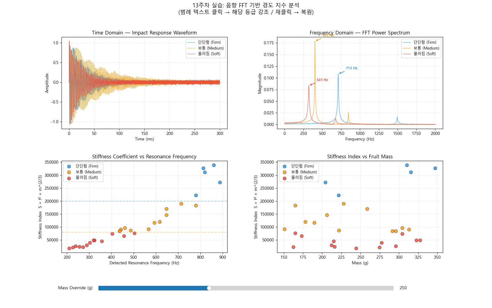

# 13주차 실습보고서: 음향 특성 및 FFT 기반 경도 분석

## 1. 실습 개요

- **목적**: 충격 가진 후 발생하는 공명 주파수를 이용한 음향 비파괴 검사 원리 이해 및 FFT 분석을 통한 과실 경도 지수 산출
- **실습 일자**: 2026년 5월 29일
- **작성자**: 202118381 / 안재형

## 2. FFT 주파수 스펙트럼 분석

- 대표 샘플 3종(단단함, 보통, 물러짐)에 대한 시간 영역의 충격 응답 파형과 FFT 파워 스펙트럼을 비교 분석한 결과는 다음과 같다.

| 샘플 등급 | 공명 주파수($f$) 대역 | 스펙트럼 피크 형태 특징 |
|-----------|-----------------------|-------------------------|
| 단단함(Firm) | 600~900 Hz | 고주파수 대역에서 뾰족하고 진폭이 큰 피크가 뚜렷하게 나타남 |
| 보통(Medium) | 400~600 Hz | 중간 주파수 대역에서 피크가 발생하며, 피크의 폭이 다소 넓어짐 |
| 물러짐(Soft) | 200~400 Hz | 저주파수 대역에서 완만하고 진폭이 낮은 피크가 나타남 |

- **신호 분석 환경**: 샘플링 주파수($f_s$) 44,100 Hz, 분석 시간 길이 0.3초의 타격 신호에 대해 고속 푸리에 변환(`np.fft.rfft`)을 수행한다. 노이즈를 효과적으로 배제하기 위해 `scipy.signal.find_peaks` 알고리즘을 사용했으며, 최대 피크 진폭의 30% 이상인 성분 중 가장 지배적인 공명 피크 주파수를 자동으로 검출하여 분석에 활용한다.

## 3. 경도 지수(Stiffness Coefficient) 산출

- **수식**: $S = f^2 \times m^{2/3}$
- 각 등급별 대표 샘플의 실측 질량($m$)과 검출된 공명 주파수($f$)를 기초로 경도 지수를 산출하고 성숙 등급을 분류한 결과는 다음과 같다.

| 샘플 번호 | 질량($m$, kg) | 공명 주파수($f$, Hz) | 경도 지수($S$) | 판정 등급 |
|-----------|---------------|----------------------|----------------|-----------|
| Sample A | 0.316 | 820.0 | 311,784 | 단단함 (Firm) |
| Sample B | 0.291 | 436.7 | 83,804 | 보통 (Medium) |
| Sample C | 0.327 | 320.0 | 48,647 | 물러짐 (Soft) |

- **물리적 배경**: 구형(Spherical) 탄성체의 고유 진동 이론에 근거하여, 질량이 서로 다른 과실 간 고유 진동 주파수($f^2$)와 질량($m^{2/3}$) 변수를 결합해 과일 고유의 구조적 강도를 나타내는 경도 지수($S$)를 산출한다. 이를 통해 과실 크기 편차에 의한 주파수 왜곡을 제거하고 객관적인 탄성 특성값을 도출한다.

## 4. 고찰 및 결론

### 공명 주파수와 과실 경도의 상관관계
 
&nbsp;&nbsp;과일 조직이 단단할수록 탄성 계수(Elastic modulus)가 높아 동일한 충격을 가했을 때 높은 진동수(고주파)로 진동하게 된다. 반면 숙성 또는 부패 등으로 조직이 연화되면 탄성이 줄어들어 둔탁한 소리(저주파)가 발생한다. 따라서 공명 주파수는 과육의 조직 상태와 경도를 직접적으로 반영한다.

### 질량 보정의 필요성

&nbsp;&nbsp;과일의 공명 주파수는 경도뿐만 아니라 크기(질량)에도 반비례하는 성질이 있다. 즉, 같은 경도를 가진 과일이라도 크기가 크면 주파수가 낮게 측정될 수 있다. 따라서 $S = f^2 \times m^{2/3}$ 수식과 같이 질량의 영향을 보정해주어야만 과일의 크기와 무관하게 일관되고 객관적인 경도 판정이 가능하다.

### 종합 결론

&nbsp;&nbsp;FFT 변환을 통한 음향 스펙트럼 분석은 과일 내부의 구조적 강도를 비파괴적으로 평가할 수 있는 효과적인 방법이다. 특히 단순히 주파수만을 측정하는 것에 그치지 않고 질량을 반영한 경도 지수($S$)를 산출함으로써, 다양한 크기의 과일에 대해서도 정확하게 숙성도를 판별 및 분류할 수 있음을 확인했다.

### 실습의 한계 및 오차 원인 분석

- &nbsp;&nbsp;**물리적 타격의 가변성**: 충격 가진 시 타격 도구의 강도와 접촉 각도가 완벽하게 일정하지 않아 진동 모드의 여기(excitation) 에너지가 달라질 수 있으며, 이는 FFT 스펙트럼 피크 진폭의 오차를 유발할 수 있다.
- &nbsp;&nbsp;**배경 소음의 혼입**: 측정 환경 내의 기계음이나 인프라 노이즈 등 외부 주파수 성분이 센서(마이크)에 기록될 경우, 과일의 실제 공명 주파수 대신 외부 노이즈 피크가 지배적 피크로 잘못 검출될 가능성이 존재한다.
- &nbsp;&nbsp;**구형 탄성체 가정의 한계**: 실제 과일은 완벽한 구형이 아니며 내부에 비균질한 씨앗이나 공동(빈 공간)이 존재할 수 있다. 이러한 내부 구조적 불균일성은 이론적인 $S = f^2 \times m^{2/3}$ 수식 모델의 가정과 일치하지 않아 오차가 발생할 수 있으므로, 향후 형상 보정 계수의 추가 모델링이 요구된다.
