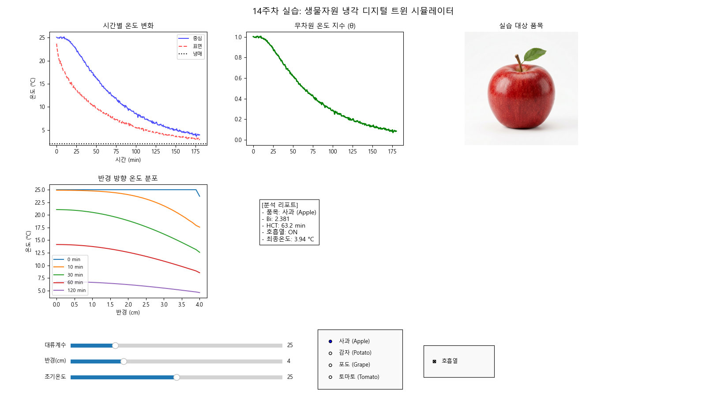

# 14주차 실습보고서: 열적 특성 및 냉각 시뮬레이션

## 1. 실습 개요

- **목적**: 과실 냉각 과정의 1D 구형 열전도 편미분 방정식(PDE) 해법 이해 및 열물성 파라미터 영향 분석
- **실습 일자**: 2026년 5월 29일
- **작성자**: 202118381 / 안재형

## 2. 기본 열물성 파라미터 조사

- 시뮬레이션에 사용된 사과의 기본 열물성 데이터를 정리한다.

| 파라미터 | 기호 | 단위 | 적용 값 | 물리적 의미 |
|----------|------|------|---------|-------------|
| 비열 | $C_p$ | J/kg·℃ | 3,800 | 과일의 온도를 변화시키는 데 필요한 열량 |
| 열전도율 | $k$ | W/m·℃ | 0.42 | 과일 내부에서 열이 이동하는 정도 |
| 밀도 | $\rho$ | kg/m³ | 840 | 과일의 단위 부피당 질량 |
| 열확산율 | $\alpha$ | m²/s | 1.316×10⁻⁷ | 내부 온도가 균일해지는 데 걸리는 확산 속도 |

## 3. 시뮬레이션 결과 분석

- **시뮬레이션 지배 방정식 및 경계 조건**: 본 냉각 시뮬레이션은 구형 좌표계에서의 1차원 비정상 상태(Unsteady-state) 열전도 지배 방정식을 기반으로 수행한다.
  $$\frac{\partial T}{\partial t} = \alpha \left( \frac{\partial^2 T}{\partial r^2} + \frac{2}{r} \frac{\partial T}{\partial r} \right)$$
  여기서 $\alpha = \frac{k}{\rho C_p}$는 열확산율이다. 중심($r=0$)에서의 경계 조건은 대칭성($\left.\frac{\partial T}{\partial r}\right|_{r=0} = 0$)을 따르며, 표면($r=R$)에서는 외부 냉매와의 대류 경계 조건($-k \left.\frac{\partial T}{\partial r}\right|_{r=R} = h (T|_{r=R} - T_{\infty})$)이 적용된다.

### 3.1. 대류 열전달 계수($h$) 변화에 따른 냉각 특성

- **고정 조건**: 반경($R$) = 4 cm, 초기 온도($T_{init}$) = 25 ℃
- 대류 열전달 계수($h$)를 10, 50, 100 W/m²·℃로 변화시키며 이에 따른 비오트 수 및 냉각 반감기를 분석한 결과는 다음과 같다.

| 대류 계수($h$) | 비오트 수($Bi$) | 반감기(분) | 냉각 속도 평가 |
|----------------|-----------------|------------|----------------|
| 10 (자연 대류) | 0.952 | 117.1 | 매우 느림 |
| 50 (강제 송풍) | 4.762 | 47.4 | 보통 (가장 일반적인 예냉 방식) |
| 100 (급속 냉각)| 9.524 | 39.0 | 빠름 (단축 효과가 점차 둔화됨) |

### 3.2. 과실 크기(반경 $R$) 변화에 따른 영향

- **고정 조건**: 대류 계수($h$) = 50 W/m²·℃, 초기 온도($T_{init}$) = 25 ℃
- 사과의 반경($R$)을 3, 5, 8 cm로 조절하여 크기 변화가 냉각 반감기 및 비오트 수에 미치는 영향을 분석한 결과는 다음과 같다.

| 과실 반경($R$) | 비오트 수($Bi$) | 반감기(분) | 비고 |
|----------------|-----------------|------------|------|
| 3 cm (소과) | 3.571 | 30.7 | 내부 열이 빠르게 방출됨 |
| 5 cm (중과) | 5.952 | 66.9 | 표준적인 냉각 속도 |
| 8 cm (대과) | 9.524 | 147.7 | 외부 대비 내부 냉각이 상당히 지연됨 |

## 4. 고찰 및 결론

### 비오트 수(Biot Number) 분석

- **정의 및 계산 수식**: 비오트 수($Bi$)는 고체 내부의 열전도 저항에 대한 표면의 대류 열전달 저항 비율을 나타내는 무차원 수이며, 구형 물체에서는 $Bi = \frac{h R}{k}$ 로 산출한다.
- **적용 가능성 판단**: 사과와 같은 생물자원은 냉각 시 비오트 수(Bi)가 대개 0.1보다 훨씬 큰 값(0.9~9.5 등)을 나타낸다. 이는 표면에서의 대류 열전달 저항보다 물질 내부의 전도 열 저항이 훨씬 크다는 것을 의미한다. 따라서 대상 내부의 온도 구배가 크게 발생하므로, 내부 온도가 균일하다고 가정하는 집중 열용량계(Lumped system) 해석은 부적합하며 내부 온도 분포를 고려한 편미분 방정식 해석이 필수적이다.

### 냉각 파라미터 영향 요약

- 대류 열전달 계수($h$)가 증가하면 표면과 냉매 간의 열 교환이 활발해져 반감기가 짧아지지만, Bi가 커지면서 내부 전도 속도가 병목이 되어 일정 수준 이상에서는 냉각 시간 단축 효과가 둔화된다. 반면 과실의 크기($R$)가 커질수록 열이 배출되어야 하는 부피 대비 표면적 비율이 감소하고 중심에서 표면까지의 열전달 경로가 길어져 냉각 반감기가 급격히 증가한다.

### 종합 결론

- 생물자원의 냉각 공정 설계 시 과실의 크기와 열적 물성에 따라 적절한 대류 열전달 계수를 선정해야 한다. 너무 강한 송풍은 냉각 효율 증가폭 대비 불필요한 에너지 낭비를 초래할 수 있으며, 크기가 큰 과실의 경우 내부 냉각 속도 지연을 고려한 충분한 예냉 시간이 확보되어야 한다. 이를 위해 1D 구형 열전도 시뮬레이션을 통한 사전 검증이 매우 유용함을 확인했다.

### 실습의 한계 및 오차 원인 분석

- &nbsp;&nbsp;**상변화 및 잠열 효과 배제**: 실제 과일 냉각 과정에서 온도가 강하하여 동결점 이하로 내려가거나 수분이 존재할 때 발생하는 상변화 잠열(Latent Heat) 효과가 본 시뮬레이션에서는 현열(Sensible Heat) 단일 모델로만 처리되어 실제 냉각 곡선과 오차가 발생할 수 있다.
- &nbsp;&nbsp;**열물성치의 온도 의존성 무시**: 과일 내부의 열물성 파라미터(비열, 열전도율 등)는 온도 변화에 따라 실시간으로 변화하지만, 시뮬레이션에서는 이를 고정된 상수로 가정하여 계산 편차가 생길 수 있다.
- &nbsp;&nbsp;**표면 대류 계수의 균일성 가정**: 실제 예냉기 내부에서는 기류 유동에 의해 과일 표면 부위별 대류 열전달 계수($h$)에 편차가 발생하나, 시뮬레이션에서는 과일 표면 전체에 균일한 $h$가 작용한다고 가정하여 오차가 발생할 수 있다.
